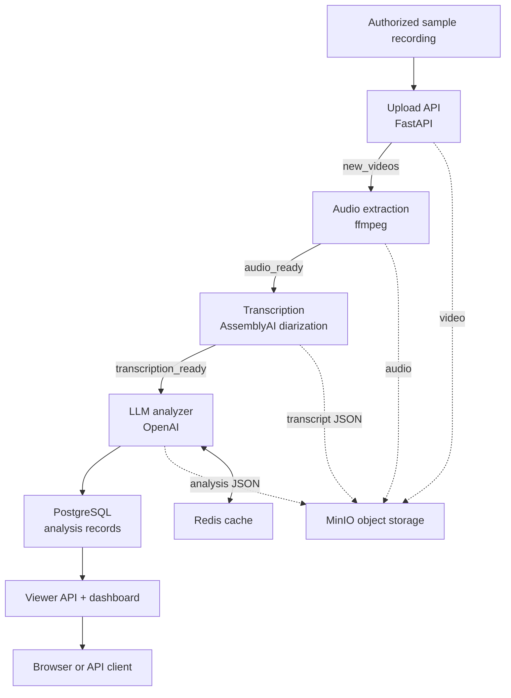

<div align="center">

# Psychology Session Analyzer

### Event-driven microservices for asynchronous audio processing, diarized transcription, and structured LLM analysis

<p>
  
  
  
  
  
</p>

</div>

## Overview

Psychology Session Analyzer is an event-driven Python system that turns an authorized recording into a structured, evidence-grounded analysis. Independently deployable services communicate through RabbitMQ, while object storage, caching, and durable persistence keep each processing stage isolated and observable.

The pipeline extracts audio from an uploaded video, transcribes it with speaker diarization, produces JSON-constrained LLM insights, and exposes completed results through a read-only FastAPI API and dashboard.

> **Educational project, not a clinical product.** This system is not designed or validated for diagnosis, treatment, or clinical decision-making. It must only be used with synthetic, public, or explicitly authorized recordings that contain no personally identifiable health information.

## Engineering highlights

| System design | AI pipeline | Product surface |
| :--- | :--- | :--- |
| Event-driven microservices with durable queues, retries, containers, logging, and separated data stores. | Speaker diarization, transcript chunking, parallel LLM calls, JSON-constrained analysis, cache-first retrieval, and evidence quotes. | Upload API, read-only analysis API, OpenAPI documentation, and a lightweight dashboard for browsing completed analyses. |

## Pipeline architecture



The analyzer also emits an `analysis_ready` event after persistence, leaving a clean integration point for future notifications or downstream reporting.

## Structured analysis

The LLM stage returns a constrained JSON document instead of free-form text. Depending on the content of an authorized sample, it can include:

- inferred participant roles and per-utterance topic/emotion labels;
- a concise session summary with evidence quotes;
- positive and negative mood triggers;
- suggested next-session follow-up items and homework assignments mentioned in the conversation;
- selected structured indicators when explicitly supported by the transcript.

Long transcripts are split into bounded chunks. The service analyzes chunks concurrently, merges compatible fields, removes duplicate evidence, and refines the final summary and follow-up list. Redis is checked before a new LLM request and PostgreSQL acts as the durable source of truth.

## Local viewer

The viewer service exposes the existing API and a small dashboard at `http://localhost:8001/`. It lists completed sessions and renders the stored analysis without re-running transcription or LLM inference.

| Endpoint | Purpose |
| :--- | :--- |
| `GET /` | Lightweight local dashboard |
| `GET /health` | Service health check |
| `GET /videos` | List analyzed sessions |
| `GET /videos/{session_id}` | Fetch full structured analysis |
| `GET /videos/{session_id}/summary` | Fetch summary only |
| `GET /docs` | Interactive OpenAPI documentation |

## Technology stack

| Area | Tools |
| :--- | :--- |
| APIs | FastAPI, Uvicorn, Pydantic |
| Orchestration | Docker, Docker Compose |
| Events | RabbitMQ with durable queues and manual acknowledgements |
| Storage | MinIO object storage, PostgreSQL |
| AI services | AssemblyAI transcription with speaker labels, OpenAI structured JSON analysis |
| Performance | Redis cache, transcript chunking, parallel LLM calls |
| Observability | Structured service logging, DataDog Agent |

## Run locally

### Prerequisites

- Docker and Docker Compose
- An [AssemblyAI API key](https://www.assemblyai.com/) for transcription
- An OpenAI API key for the analyzer

### Setup

1. Clone the repository and create your local configuration:

   ```bash
   git clone https://github.com/LironTal01/Psychology_Session_Analyzer.git
   cd Psychology_Session_Analyzer
   cp .env.example .env
   ```

2. Add `OPENAI_API_KEY` and `ASSEMBLYAI_API_KEY` to `.env`. Keep `.env` private.
3. Start the system:

   ```bash
   docker compose up --build
   ```

4. Open the local viewer at `http://localhost:8001/` or inspect the API at `http://localhost:8001/docs`.

To collect container logs with DataDog, add `DD_API_KEY` to `.env` and start the optional observability profile instead:

```bash
docker compose --profile observability up --build
```

### Upload an authorized sample

```bash
curl -X POST http://localhost:8000/upload \
  -F "file=@./authorized-sample.mp4"
```

The upload endpoint returns immediately after storing the video and publishing the first event. Processing continues asynchronously; refresh the viewer after the downstream services complete their work.

For local-only development, Docker Compose supplies the bundled MinIO, RabbitMQ, PostgreSQL, and Redis services. The credentials in `docker-compose.yml` are development defaults and must be replaced before any non-local deployment.

## Project structure

```text
.
├── upload_service/            # FastAPI upload endpoint and new_videos publisher
├── audio_extractor_service/   # ffmpeg audio extraction and audio_ready publisher
├── transcription_service/     # AssemblyAI transcription and speaker diarization
├── llm_analyzer_service/      # Cached, structured LLM analysis and persistence
├── viewer_service/            # Read-only API and browser dashboard
├── common/                    # Shared MinIO, RabbitMQ, logging, and config helpers
├── docker-compose.yml         # Local multi-container environment
└── .env.example               # Safe configuration template
```

## Privacy and responsible use

- Do not upload real therapy recordings, identifiable health information, or data without explicit authorization.
- Treat generated labels, summaries, and follow-up suggestions as fallible model output that requires qualified human review.
- Do not expose this local development setup directly to the internet.
- This repository intentionally contains no recordings, transcripts, or API keys.

## Author

**Liron Tal**  
B.Sc. in Computer Science, Reichman University
