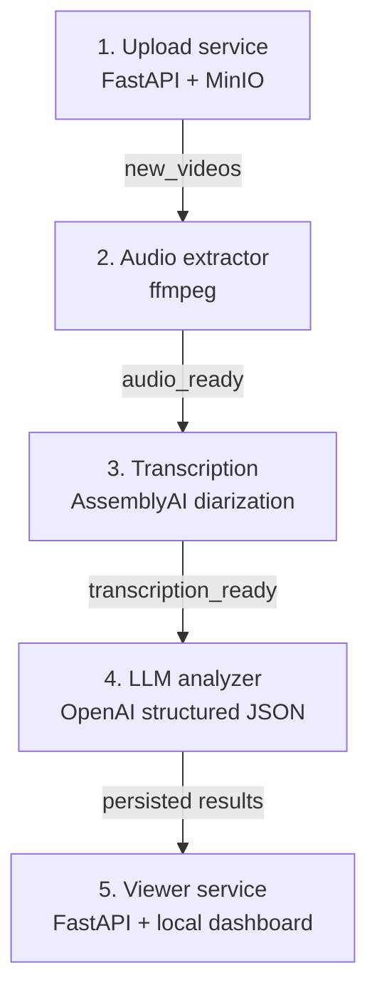

<div align="center">

# Psychology Session Analyzer

### Event-driven microservices for asynchronous audio processing, diarized transcription, and structured LLM analysis

<p>
  
  
  
  
  
</p>

</div>

## Overview

Psychology Session Analyzer is an asynchronous Python system that turns an authorized recording into a structured, evidence-grounded analysis. The workload is split into dedicated services that communicate through RabbitMQ, while MinIO, Redis, and PostgreSQL provide durable storage, caching, and retrieval at the appropriate stages.

From one upload, the system extracts audio, transcribes it with speaker diarization, produces JSON-constrained LLM insights, and makes the completed analysis available through a read-only FastAPI API and a lightweight local dashboard.

> **Educational project, not a clinical product.** The system is not designed or validated for diagnosis, treatment, or clinical decision-making. Use only synthetic, public, or explicitly authorized recordings that contain no personally identifiable health information.

## Architecture at a glance



**Supporting infrastructure:** RabbitMQ carries durable events between services; MinIO stores video, audio, transcript, and analysis artifacts; Redis avoids redundant LLM work; PostgreSQL stores completed analyses; the optional DataDog profile collects container logs.

## End-to-end workflow

1. **Upload:** the upload API stores a video in MinIO and publishes a durable `new_videos` event.
2. **Extract:** the audio-extractor consumer downloads the video, uses `ffmpeg` to generate MP3 audio, stores it in MinIO, and publishes `audio_ready`.
3. **Transcribe:** the transcription service uses AssemblyAI with speaker labels, persists the transcript JSON, and publishes `transcription_ready`.
4. **Analyze:** the LLM analyzer checks Redis and PostgreSQL before processing; on a cache miss it chunks long transcripts, runs structured OpenAI analysis, merges compatible results, and persists the completed output.
5. **Review:** the viewer service exposes the result through API endpoints and a browser dashboard. The analyzer also emits `analysis_ready` for future integrations.

## Structured insights

The LLM stage returns a validated JSON-oriented result rather than a free-form response. Depending on the content of an authorized sample, the output can include:

- inferred participant roles and per-utterance topic or emotion labels;
- a concise session summary with evidence quotes;
- positive and negative mood triggers;
- follow-up items and homework assignments mentioned in the conversation;
- selected structured indicators when explicitly supported by the transcript.

Long transcripts are split into bounded chunks, analyzed concurrently, and merged with duplicate cleanup. Redis is checked before new inference, and PostgreSQL remains the durable source of truth.

## Engineering highlights

| Concern | Implementation |
| :--- | :--- |
| **Asynchronous processing** | Durable RabbitMQ queues, manual acknowledgements, retry loops, and one-message-at-a-time consumer dispatch. |
| **Service boundaries** | Separate upload, audio extraction, transcription, LLM analysis, and viewer services, each in its own Docker container. |
| **Cost and latency control** | Cache-first analysis retrieval, transcript chunking, and bounded parallel LLM calls. |
| **Data lifecycle** | MinIO for binary and JSON artifacts, PostgreSQL for searchable completed results, and Redis for fast analysis reuse. |
| **Operational visibility** | Service-level logging and an optional DataDog Compose profile. |
| **Local product surface** | Upload API, OpenAPI documentation, and a lightweight dashboard over the existing result API. |

## Technology stack

| Area | Tools |
| :--- | :--- |
| APIs | FastAPI, Uvicorn, Pydantic |
| Orchestration | Docker, Docker Compose |
| Events | RabbitMQ |
| Storage | MinIO, PostgreSQL |
| AI services | AssemblyAI speaker diarization, OpenAI structured JSON analysis |
| Performance | Redis, transcript chunking, parallel LLM calls |
| Observability | Python logging, DataDog Agent |

## Local viewer and API

Once analyses are available, open the dashboard at `http://localhost:8001/`. It reads stored results and never triggers transcription or new LLM inference.

| Endpoint | Purpose |
| :--- | :--- |
| `GET /` | Lightweight local dashboard |
| `GET /health` | Service health check |
| `GET /videos` | List analyzed sessions |
| `GET /videos/{session_id}` | Retrieve one full structured analysis |
| `GET /videos/{session_id}/summary` | Retrieve only the summary |
| `GET /docs` | Interactive OpenAPI documentation |

## Run locally

### Prerequisites

- Docker and Docker Compose
- An [AssemblyAI API key](https://www.assemblyai.com/) for transcription
- An OpenAI API key for the analyzer

### Setup

1. Clone the repository and prepare local configuration:

```bash
git clone https://github.com/LironTal01/Psychology_Session_Analyzer.git
cd Psychology_Session_Analyzer
cp .env.example .env
```

2. Add `OPENAI_API_KEY` and `ASSEMBLYAI_API_KEY` to `.env`. Keep that file private.
3. Start the pipeline:

```bash
docker compose up --build
```

4. Open `http://localhost:8001/` for the dashboard or `http://localhost:8001/docs` for the viewer API.

To collect container logs with DataDog, add `DD_API_KEY` to `.env` and use:

```bash
docker compose --profile observability up --build
```

### Upload an authorized sample

```bash
curl -X POST http://localhost:8000/upload \
  -F "file=@./authorized-sample.mp4"
```

The upload endpoint returns after storage and event publication. Processing continues asynchronously, so refresh the viewer after the downstream services complete their work.

## Repository map

```text
.
├── common/
│   ├── config.py                 # Shared environment-backed configuration
│   ├── logging_utils.py          # Shared logging helpers
│   └── storage_client.py         # MinIO wrapper used across services
├── upload_service/
│   └── app/main.py               # Upload API and new_videos publisher
├── audio_extractor_service/
│   └── app/
│       ├── audio_extractor.py    # Video download, ffmpeg extraction, MinIO upload
│       ├── consumer.py           # new_videos consumer and audio_ready publisher
│       └── main.py               # Service entrypoint
├── transcription_service/
│   ├── transcription_worker.py   # AssemblyAI submission, polling, and transcript storage
│   ├── consumer.py               # audio_ready consumer and transcription_ready publisher
│   └── main.py                   # Service entrypoint
├── llm_analyzer_service/
│   ├── analyzer.py               # Cache/database-aware analysis orchestration
│   ├── llm_client.py             # Chunking, structured prompts, merge and refinement logic
│   ├── consumer.py               # transcription_ready consumer and analysis_ready publisher
│   ├── database.py               # PostgreSQL persistence
│   └── redis_cache.py            # Redis analysis cache
├── viewer_service/
│   ├── main.py                   # Read-only FastAPI application and dashboard route
│   ├── router.py                 # Analysis retrieval endpoints
│   ├── database.py               # Read-only PostgreSQL queries
│   ├── models.py                 # API response models
│   └── static/index.html         # Local analysis dashboard
├── docker-compose.yml            # Multi-container local environment
├── .env.example                  # Configuration template
└── README.md
```

## Responsible use

- Do not upload real therapy recordings, identifiable health information, or data without explicit authorization.
- Treat generated labels, summaries, and follow-up suggestions as fallible model output requiring qualified human review.
- Do not expose this local development setup directly to the internet.
- This repository intentionally contains no recordings, transcripts, or API keys.

## Author

**Liron Tal**  
B.Sc. in Computer Science, Reichman University
